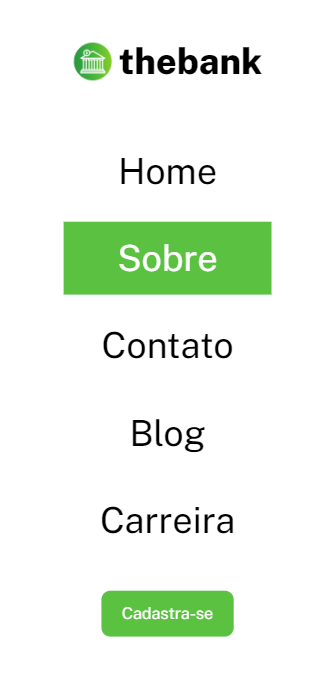

# Menu Layout

Essa é a solução da realização de um Layout de Menu proposto pelo curso DevQuest.

## Desafio 
Criar um header que seja responsivo, para ser aprimorado as habilidades de posicionamento de elementos usando flexbox.

## Screenshots

Versão para desktop

Versão para mobile

## Tecnologias utilizadas

- HTML
- CSS
- Flexbox

